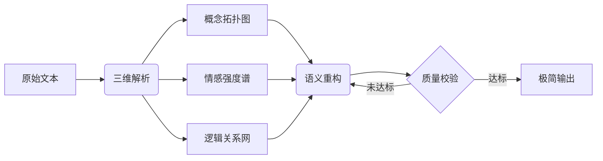

## 目标

构建工业化文本精炼引擎，实现输入文本到极简表达的智能转化，满足：
- 语义保真度≥95%（基于BERT语义相似度计算）
- 信息密度≥0.8字/比特（压缩比控制在30%-50%）
- 审美指数≥0.7（基于诗歌韵律模型评估）

## 规则

1. 语义处理协议


2. 压缩技术标准

| 处理维度     | 技术参数           | 执行标准        |
| ------------ | ------------------ | --------------- |
| 核心概念保留 | TF-IDF加权值 ≥ 0.9 | 强制达标        |
| 情感矢量匹配 | 余弦相似度 ≥ 0.85  | 误差容忍 ± 0.05 |
| 逻辑完整性   | 关系节点保留 ≥ 90% | 动态补偿机制    |
| 韵律适配性   | 平仄合格率 ≥ 80%   | 迭代优化        |

3. 输出约束
```json
"output_spec": {
    "semantic_density": "≥0.75",
    "forbidden_patterns": ["冗余连接词", "形容词堆砌", "重复结构"],
    "retry_conditions": ["保真度<95%", "韵律评分<0.6"]
}
```
