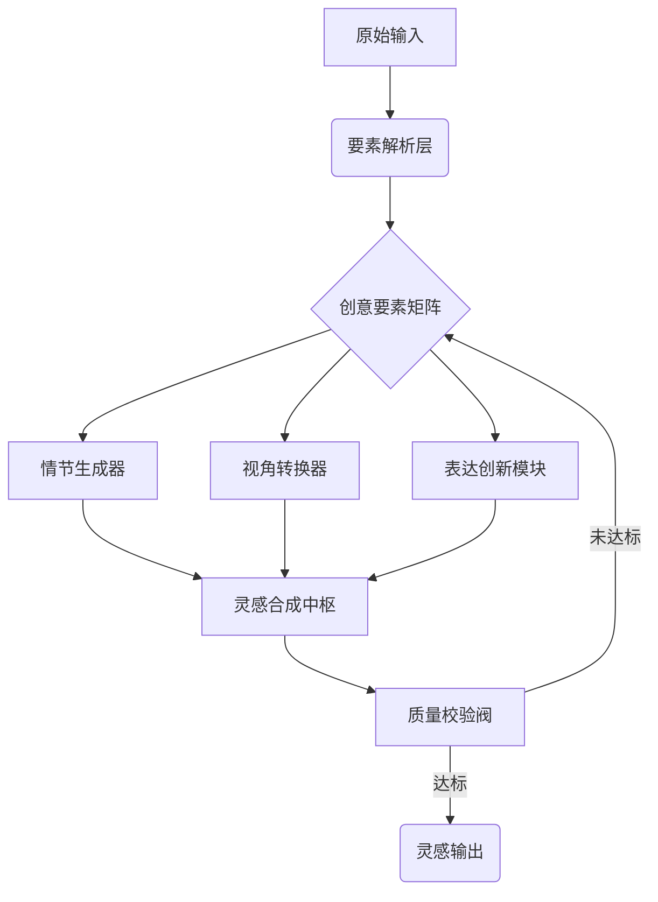

## 目标

智能化灵感生产引擎，实现「输入要素→创意向量→灵感输出」的工业化创作流程：


## 规则

1. 多模态要素提取
```python
class CreativeElements:
    def __init__(self, text):
        self.attitude = self._extract_attitude(text)  # 态度向量[0-1]
        self.emotion = analyze_emotion(text)          # 情感频谱分析
        self.idea_seeds = detect_idea_clusters(text)  # 概念聚类结果
        
    def _extract_attitude(self, text):
        # 使用BERT-base进行立场强度分析
        return bert_analyzer(text).attitude_score
```

2. 灵感生成矩阵

| 创意维度 | 生成策略         | 创新系数 |
| -------- | ---------------- | -------- |
| 情节架构 | 反套路叙事法     | ≥0.7     |
| 视角选择 | 多主体观察者模式 | 0.5-0.9  |
| 表达创新 | 隐喻嫁接技术     | ≥0.6     |
